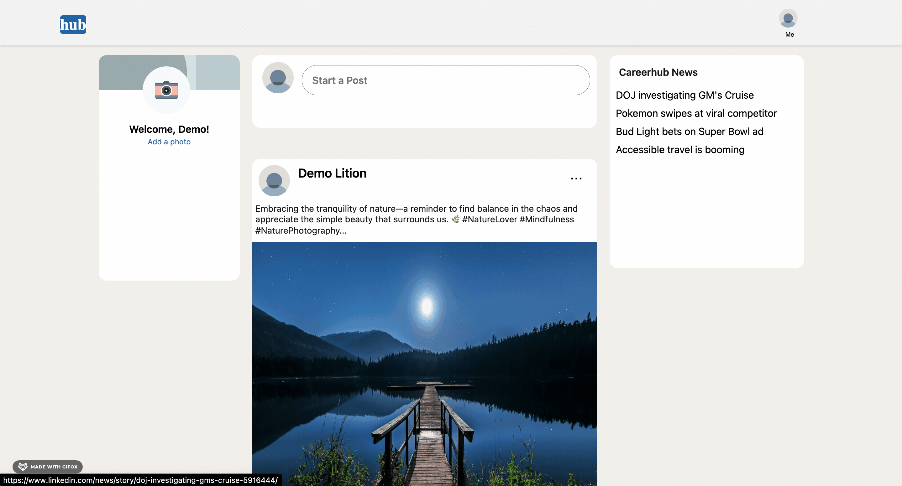
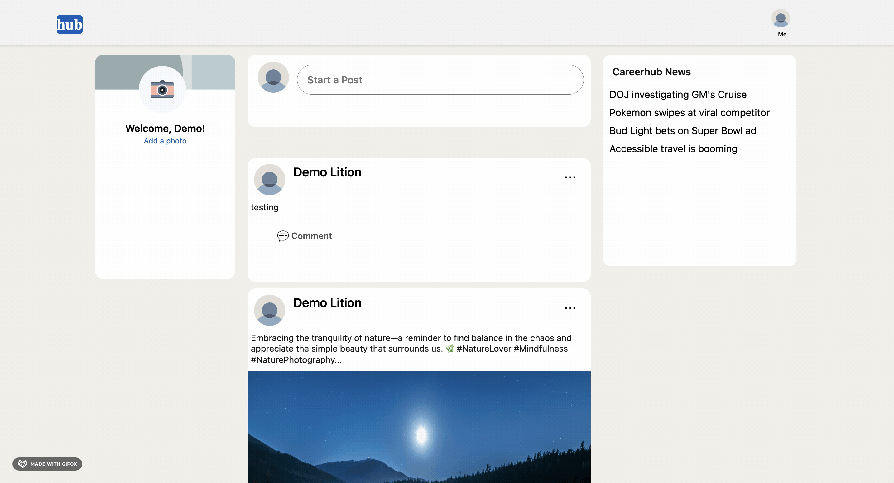
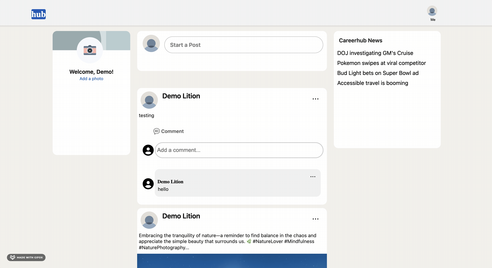

# Careerhub

## What is Careerhub?

Careerhub is a clone of Linkdln that gives you the opportunity to connect with peers and professionals and expand your network to help you in your career. You can create professional profile, add experiences and you can post pictures.

[Check out the live site](https://careerhub-iofc.onrender.com)

## Features

### 1. Hosting

Careerhub is hosted on [Render](https://render.com/) for seamless deployment and reliable performance.

### 2. User Authentication

- **Sign Up:** Users can create accounts to access Careerhub features.
- **Sign In/Out:** Secure authentication allows users to sign in and out of their accounts.
- **Guest Login:** Experience a demo using a guest login.

### 3. Posts - CRUD


- **Create:** Signed-in users can share professional updates and articles.
- **Read:** Users can view posts shared by their network.
- **Update:** Edit your posts to keep information current.
- **Delete:** Remove posts that are no longer relevant.



```javascript
// in the feed page you have a button to create a post and under the button it fetches all the post and displays them where you have the option to delete and edit post.

<div className="body">
  <div className="postWrapper">
    
    <button onClick={openPostModal}> Start a Post </button>
    {modalType && (
      <PostModal user={sessionUser.user} userName={sessionUser.username} />
    )}
  </div>
  <br />

  <div className="allPosts">
    <PostIndex type={"feed"} />
  </div>
</div>
```


### 4. Comments

- **Add Comments:** Signed-in users can add comments to posts for interactive discussions.
- **Edit Comments:** Users have the ability to modify their comments for accuracy.
- **Delete Comments:** Remove comments when necessary.
  

```javascript
// when this component is being called it gives a button where you can type your comments
const CreateComment = ({ postId, parentCommentId, onAddComments }) => {
  const userId = useSelector((state) => state.session.user.id);
  const dispatch = useDispatch();
  const [body, setBody] = useState("");

  //this is where you create the comment and add it the store
  const handleCreateComment = (e) => {
    e.preventDefault();
    onAddComments(body);
    dispatch(createComment(postId, userId, body, parentCommentId));
    setBody("");
  };
  //the input box to add a comment
  return (
    <div className="commentForm">
      <i className="fa-solid fa-user-circle fa-2x" />
      <form>
        <input
          value={body}
          placeholder="Add a comment..."
          onChange={(e) => setBody(e.target.value)}
        />
        {body && <button onClick={handleCreateComment}>Post</button>}
      </form>
    </div>
  );
};
export default CreateComment;
```



```javascript
//in here you are updating a comment where you have the prefilled comments if it's not editing it just displays the comments
{
  isEditing ? (
    <div className="editCommentWrapper">
      <form>
        <input value={editedComment} onChange={handleInputChange} />
        <div className="btnToChange">
          <button
            onClick={(e) => handleUpdateComment(e)}
            className={isTyping ? "active" : "save"}
            disabled={!isTyping}
          >
            Save Changes
          </button>
          <button onClick={handleCloseBtn} className="cancel">
            Cancel
          </button>
        </div>
      </form>
    </div>
  ) : (
    <p>{comment.body}</p>
  );
}
```


```javascript
//setting the variable
const [visibleComments, setVisibleComments] = useState(3);

//updating the visibleComments valule when the button is clicked
const loadMoreComments = () => {
  setVisibleComments((prevVisibleComments) => prevVisibleComments + 3);
};

//making sure the comments count are less than the actual size of comments so it loads as long as there are comments
{
  visibleComments < Object.values(commentsObject).length && (
    <button onClick={loadMoreComments} className="loadBtn">
      Load more Comments
    </button>
  );
}
```

### 5.Profile Page

- Users can create detailed professional profiles through work experience and achievements
- Users can upload profile photo using AWS


## Technologies Used

- **Languages:** JavaScript, Ruby, HTML, CSS
- **Frontend:** React-Redux
- **Backend:** Ruby on Rails
- **Databases:** PostgreSQL
- **Hosting:** Render
- **Storage:** AWS Simple Storage Service (S3)

## Future Implementation

- Work on Connections
- Add the Like button
- Add Eduction in the profile page
- Add the option to upload pictures only
